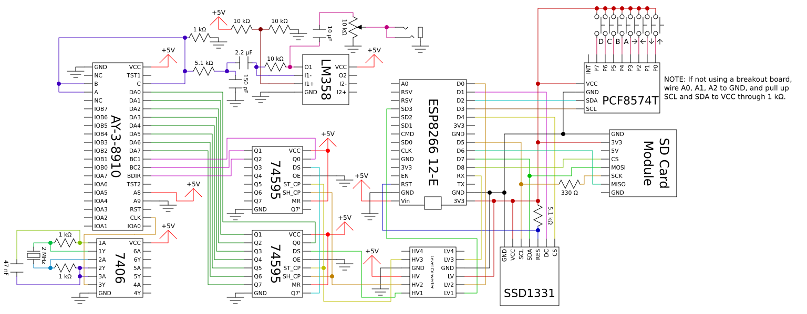

# How to Build Your Own Myrmidon

To build a Myrmidon system requires a number of components that can easily be found for purchase online. These components can then be connected via either a solderless breadboard or any other through-hole medium. This file contains information on which components you will need and how to connect them.

## Required Components

Myrmidon makes use of the following components:

- An **ESP8266** is a system-on-a-chip (SOC) useful for lightweight projects. It is similar to an Arduino in its function; in fact, it can be programmed using the Arduino IDE. As compared to an Arduino, the ESP8266 is less user-friendly and harder to use in prototyping (for instance, some of its I/O pins have various complicated behaviors upon startup), but it offers similar processing power to an Arduino Due for a lower cost. Myrmidon currently uses the **NodeMCU ESP8266-12E** circuit board, which gives the ESP8266 several useful features such as input voltage regulation and a USB serial interface for programming, while also providing a DIP housing. I got my board in a 3-pack [here,](https://www.amazon.com/KeeYees-Internet-Development-Wireless-Compatible/dp/B07HF44GBT/) though you can also buy an individual board if you want.
- The **SSD1331** is a driver chip for a 96x64 OLED display (despite the name, it has nothing to do with solid-state drives). This is a small screen with 16-bit color that can be accessed via SPI. I got mine from [this](https://www.amazon.com/dp/B07M9H8JZ7/) Amazon listing, but it looks like they have low stock; any SSD1331 board with the same pinout should be equivalent.
- You will need an **SD card module** in order to interface with an SD card. These don't have any special driver chip, because the SD card has its own internal SPI circuitry; the module is just a breakout board with some filtering circuitry and a voltage regulator. [This](https://www.amazon.com/gp/product/B00GBVXJHI/) module worked great for me.
- Of course, you also need an **SD card** or a few to plug in to the module. If you've ever owned a digital camera, there's a chance you have one lying around somewhere; if not, you'll need to buy one. Don't worry about capacity too much, as the current Myrmidon specification can't make use of more than a gigabyte of data anyway. If you don't have an SD card, you could also use a microSD card and an adapter.
- You'll need a **PCF8574T** I/O expander chip. I got mine from [this](https://www.amazon.com/gp/product/B01ICN5JB6/) package, which has a breakout board for it, making it easy to prototype.
- You'll need **various jumper wires, 8 momentary (normally open) switches, and a few resistors.** Specifically, I recommend a 330 Ω resistor and a 5.1 kΩ resistor, though there is some tolerance on these resistances, and you won't burn anything out if you use the wrong value (in the worst case, the system just won't quite work right). If you use the raw PCF8574T chip instead of a breakout board, you'll also need two 1 kΩ resistors for it. If you don't have these components lying around and don't want to search out individual ones, [this](https://www.amazon.com/ELEGOO-Electronics-Potentiometer-tie-Points-Breadboard/dp/B01ERPEMAC/) kit should have everything you need.
- You'll need a **power supply** of some sort. You can of course just power the device over USB (the current draw is small enough), but if you want to run it on its own, you'll need some kind of power source. If you have a *well-regulated* 3.3V supply, you can power the 3V3 pin directly. The NodeMCU board also has its own voltage regulator, so you can supply a higher (and dirtier) voltage to the Vin pin instead. I'm not sure what the acceptable range is, so you should keep an eye on the regulator; it's the trident-shaped chip near the center of the circuit board. If it gets too hot to touch, your input voltage is too high. I wouldn't use more than 9V personally. A breadboard power supply like the one in the link from the previous bullet point will work great if you set the jumpers to 3.3V and supply the 3V3 pin directly.
- In order to power the ESP8266, you'll need a **micro USB cable.** A lot of consumer technology uses these for charging, including older Android phones and DualShock 4 controllers, so there's a good chance you have one somewhere already.
- You'll need **a way to write SD cards from a PC.** Some laptops have an SD card slot, so if there's a mysterious slot on the side of your laptop, you can try sticking an SD card into it and seeing if it fits. (Okay, you should probably consult the manual first so as not to ruin your SD card or laptop if you're wrong.) If you don't have that luck, you can buy a USB SD card reader for around $10, though again, if you have a digital camera, check to see if you have one already.

## Assembling the Myrmidon System

See the file Docs/schematic.png for a diagram of how to wire up the various components to the ESP8266-12E; it is also shown below if you are viewing this file in a Markdown viewer.

- **SSD1331:** Wire GND to ground and VCC to one of the 3V3 pins on the ESP8266. Wire SCL to D5, SDA to D7, DC to D1, and CS to D4. Wire RES to the RST pin on the ESP8266 and pull it up to 3V3 through a 5.1 kΩ resistor. (The resistor might not be necessary but is good practice to make sure the screen doesn't accidentally get reset.)
- **SD card module:** Wire GND to ground and 3V3 to one of the 3V3 pins on the ESP8266. You can leave the other GND pin, as they're tied together, and you can leave the 5V pin alone, because it's only needed if you want to power the module from 5V instead of 3.3V. Wire CS to D8, MOSI to D7, and MISO to D6. Wire SCK to D5 along with SCL on the screen, but through a 330 Ω resistor. This is because I found that the clock pin on the SD card will interfere with the clock pin on the screen sometimes, causing serious flickering. Adding this resistance in series seems to mitigate the issue while still allowing the SD card to function.
- **PCF8574T:** Wire GND to ground and VCC to one of the 3V3 pins on the ESP8266. Wire SDA to D2 and SCL to D3. Then each of the pins P0 through P7 can be wired through a button to 3V3. They seem to be pulled down automatically, i.e. I haven't had any issues with leaving the pins floating when not tied HIGH. Leave the INT pin floating, as I'm not using interrupts. If you aren't using a breakout board that performs these functions for you, you should also tie A0, A1, and A2 to GND and pull up SCL and SDA to 3V3 through 1 kΩ resistors.
- **Power:** To power the device, you need to either supply a clean 3.3V supply between 3V3 and GND or supply a higher voltage (somewhere between 5V and 9V, I think) between Vin and GND. Again, when using a higher supply, keep an eye on the regulator; it's the trident-shaped chip near the center of the circuit board. If it gets too hot to touch, your input voltage is too high.

After the wires have all been connected, read Docs/engine.md for instructions on how to program Myrmidon with the required code.